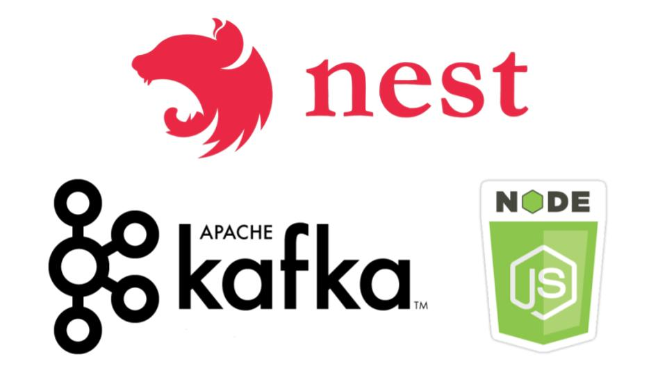

# [Kafka](https://kafka.apache.org) with [NestJS](https://nestjs.com/)



## Description

[Kafka](https://kafka.apache.org) is an open source, distributed,
[streaming](https://en.wikipedia.org/wiki/Stream_processing) platform, developed by LinkedIn in 2009 and maintained
since 2012 by the Apache Foundation.

It dedicated to **Publishing**, **subscribing**, **storing** and **processing** of **streams of records**

We will use the [NestJs Kafka module](https://docs.nestjs.com/microservices/kafka) to interact with a kafka cluster.

## Installation

```bash
npm install
```

## Running the app

```bash
# development
npm run start

# watch mode
npm run start:dev
```

## Required packages

```shell
npm npm i --save kafkajs

npm i @nest/microservices
```
