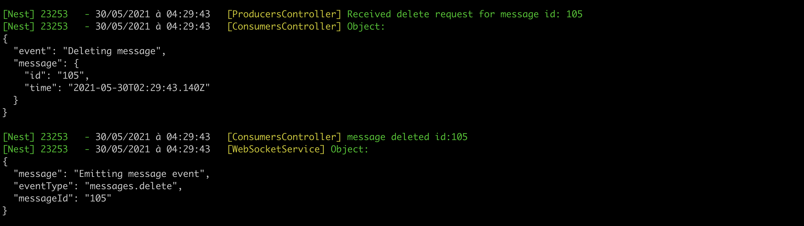

# [Kafka](https://kafka.apache.org) with [NestJS](https://nestjs.com/)


## Description

[Kafka](https://kafka.apache.org) is an open source, distributed,
[streaming](https://en.wikipedia.org/wiki/Stream_processing) platform, developed by LinkedIn in 2009 and maintained
since 2012 by the Apache Foundation.

It dedicated to **Publishing**, **subscribing**, **storing** and **processing** of **streams of records**

We will use the [NestJs Kafka module](https://docs.nestjs.com/microservices/kafka) to interact with a kafka cluster.

## Installation

```bash
npm install
```

## Start the Kafka cluster

```shell
docker-compose up
```

See [docker-compose.yml](/docker-compose.yml)

## Running the app

```bash
# development
npm run start

# watch mode
npm run start:dev
```

## Required packages

- [KafkaJs](https://www.npmjs.com/package/kafkajs)
- [PG](https://www.npmjs.com/package/pg)
- [Typeorm](https://www.npmjs.com/package/typeorm)
- [Nest Microservices](https://www.npmjs.com/package/@nest/microservices)
- [Nest Typeorm](https://www.npmjs.com/package/@nestjs/typeorm)

## Kafka config
````ts
export const KAFKA_CONFIG: KafkaOptions = {
  transport: Transport.KAFKA,
  options: {
    ...
  },
};
````
See [kafka.config.ts](/src/config/kafka.config.ts)

## Kafka microservices starter
````ts
...
app.connectMicroservice(KAFKA_CONFIG);
await app.startAllMicroservicesAsync();
...
````
See [main.ts](/src/main.ts)

## Kafka client injection
````ts
class PtoducerOrConsumer {
  ...
  @Client(KAFKA_CONFIG)
  private client: ClientKafka;
  ...
}
````
See [controllers](/src/controller)

## Producers
````ts
...
this.client.emit<string>('messages.create', {...});
...
````
See [producers.controller.ts](/src/controller/producers.controller.ts)

## Consumers
````ts
...
@EventPattern('messages.create')
handleMessage(payload: any) {
  // handle posted message => save it in db, notify subscribers, ...
}
...
````
See [consumers.controller.ts#39](/src/controller/consumers.controller.ts)

## Demo

- ### Running services
````shell
npm run start
````


- ### Create message 
```shell
curl --location --request POST 'http://localhost:3000/api/v1/producers/messages' --header 'Content-Type: application/json' --data-raw '{"pseudo": "idir", "content": "Hello, i am ready, we can start ;)"}'
```


- ### Update message
```shell
curl --location --request PUT 'http://localhost:3000/api/v1/producers/messages/{messageId}' --header 'Content-Type: application/json' --data-raw '{"content": "Hello, i am ready. \n we can start :) ?"}'
```


-  ### Delete message
```shell
curl --location --request DELETE 'http://localhost:3000/api/v1/producers/messages/{messageId}' 
```


- ### Kafdrop UI

    - #### Brokers view
    

    - #### Specific broker view
    

    - #### Topic view
    
   
    - #### Create messages topic view
    
    
    - #### Update messages topic view
    
    
    - #### Delete messages topic view
    
